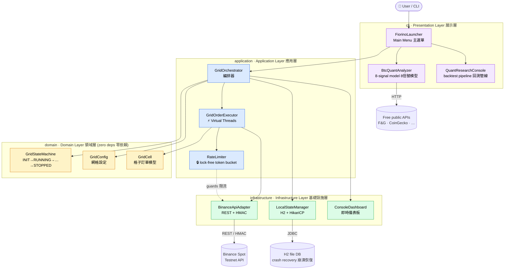

# Project Fiorino

> A Java 21 BTC spot **grid-trading bot** + **quant analysis engine** — built as a personal sandbox to practice production-grade **concurrency (Virtual Threads)**, **state-machine design with crash recovery**, and **rigorous unit testing**.

<p>
  
  
  
  
  
</p>

**🌐 Language / 語言：** [繁體中文](#繁體中文) ｜ [English](#english)

> ⚠️ **個人學習專案 / Personal Learning Project — Not for production or real-money trading.** Connects to the **Binance Spot Testnet** by default. 預設連線測試網，請勿在未完全理解程式碼前接上主網。

---

## 架構總覽 / Architecture Overview

Hexagonal (Ports & Adapters) + DDD layering — dependencies always point **inward** toward the zero-dependency domain core. 依賴方向一律由外層指向**無外部依賴的領域核心**。



---

<a name="繁體中文"></a>
# 繁體中文

## 這是什麼?

Project Fiorino 是一個用 **Java 21** 從零打造的**比特幣現貨網格交易機器人**,外加一個獨立的 **BTC 量化分析引擎**。

網格交易策略會把指定的價格區間切成等距的格子,在每個格子掛買單/賣單,藉由價格在區間內的來回波動賺取價差。但這個專案的**真正目的不是賺錢**,而是拿一個「夠複雜、夠真實」的題目,深入練習以下幾個業界關注的硬核主題:

- **Java 21 虛擬執行緒 (Virtual Threads)** — 用直覺的「一訂單一執行緒」模型管理大量併發掛單,而不必煩惱傳統執行緒池調校。
- **雙層狀態機 + 崩潰恢復 (Crash Recovery)** — 用內嵌 H2 資料庫持久化訂單狀態,模擬行程被強制中斷後的「重啟 → 對賬 → 續跑」流程。
- **無鎖限流 (Lock-Free Rate Limiting)** — 以 CAS 實作 Token Bucket,精準對應幣安的 Request Weight 計費制,避免觸發 HTTP 429 封禁。
- **可測試的領域設計** — Domain 層零外部依賴,純函式化的網格計算與狀態轉移,讓單元測試又快又穩(目前 **46 個測試全綠**)。

> 💡 **給面試官的快速導覽**:最值得看的四個檔案 ——
> [`RateLimiter.java`](src/main/java/com/fiorino/application/ratelimit/RateLimiter.java)(無鎖 CAS 令牌桶)、
> [`GridStateMachine.java`](src/main/java/com/fiorino/domain/statemachine/GridStateMachine.java)(狀態機 + 熔斷)、
> [`Main.java`](src/main/java/com/fiorino/Main.java)(手動 DI + 優雅停止)、
> [`BtcQuantAnalyzer.java`](src/main/java/com/fiorino/cli/quant/BtcQuantAnalyzer.java)(8 信號加權模型)。

---

## 技術亮點 (Technical Highlights)

### 1. Java 21 虛擬執行緒:一訂單一執行緒
網格策略可能同時管理數十個掛單,每個掛單都需要輪詢狀態、處理成交、補掛新單。傳統做法要靠執行緒池 + callback,程式碼難讀且容易調校失誤。本專案改用 **Virtual Thread**,讓每個訂單任務都是一條獨立的虛擬執行緒——阻塞在 I/O 或 `Thread.sleep()` 時**完全不佔用 OS 載體執行緒 (carrier thread)**,因此可以用最直覺的同步寫法表達高併發邏輯。

### 2. 無鎖 Token Bucket 限流器
幣安 API 採「Request Weight」計費(下單 = 1、查全部掛單 = 40、帳戶資訊 = 20...),每 IP 每分鐘上限 1200 weight,超量即 HTTP 429 封禁。[`RateLimiter`](src/main/java/com/fiorino/application/ratelimit/RateLimiter.java) 的設計重點:

- **保守安全閾值**:只用官方額度的 80%(960/min),預留 20% 給緊急查詢。
- **滑動窗口令牌桶**:令牌依時間流逝以固定速率補充,呼叫前先 `acquire(weight)`。
- **完全無鎖**:用 `AtomicLong` + `compareAndSet` (CAS) 原子扣減/補充令牌,無 `synchronized`、無 `ReentrantLock`,高併發下零鎖競爭。
- **Virtual-Thread 友善**:令牌不足時用 `Thread.sleep()` 阻塞等待——在虛擬執行緒上是零成本操作。

### 3. 雙層狀態機 + 崩潰恢復
狀態管理刻意拆成兩層,職責分離:
- **L1 宏觀** ([`GridStateMachine`](src/main/java/com/fiorino/domain/statemachine/GridStateMachine.java)):管理整個 Bot 的生命週期 `INIT → RUNNING → PAUSED / CRASHED_RECOVERING → STOPPED`。
- **L2 微觀** (`GridCell`):管理每一個網格格子內訂單的生命週期。

```
   ┌──────┐   start()   ┌─────────┐
   │ INIT │ ──────────► │ RUNNING │ ◄────────────┐
   └──────┘             └─────────┘              │
                            │  networkError()    │ recover()
                            ▼                     │
                   ┌────────────────────┐        │
                   │ CRASHED_RECOVERING │ ───────┘
                   └────────────────────┘
```

並發安全採「讀寫分離」:狀態讀取用 `AtomicReference`(免鎖、保證可見性),狀態**轉移**則用 `ReentrantLock` 序列化(避免兩條執行緒同時轉移造成競態)。另含**熔斷保護**:崩潰自動恢復超過 5 次即拒絕續跑、轉入 `STOPPED`,要求人工介入。

### 4. 金額精度與優雅停止
- 所有價格/數量計算一律用 `BigDecimal`,杜絕 `double` 浮點誤差(交易系統的硬性要求)。
- `Main` 註冊 **JVM Shutdown Hook**,收到 `SIGTERM` / `Ctrl+C` 時依序「撤銷所有掛單 → 停止儀表板 → 關閉連線池 → 關閉執行緒池」,確保不留孤兒訂單。

### 5. 刻意不使用 Spring
所有依賴都在 [`Main`](src/main/java/com/fiorino/Main.java) 手動注入 (Manual DI)。換來三個好處:**啟動 < 1 秒**(無容器掃描)、**依賴圖即程式碼**(一眼看懂相依關係)、**故障點清晰**(DI 失敗立刻在 Main 暴露)。

---

## BTC 量化分析引擎 (免費,無需 API Key)

主選單的第二個模式是完全獨立的量化分析模組 [`BtcQuantAnalyzer`](src/main/java/com/fiorino/cli/quant/BtcQuantAnalyzer.java)。它從多個**免費公開 API** 抓取多維市場數據,透過加權評分模型輸出下個月 BTC 的價格預測區間:

| # | 信號 | 權重 | 數據來源 | 意義 |
|---|------|:----:|----------|------|
| 1 | Fear & Greed Index | 12% | alternative.me | 市場情緒 |
| 2 | Open Interest Trend | 18% | Binance fapi | 未平倉量趨勢 |
| 3 | Funding Rate | 13% | Binance fapi | 永續資金費率 |
| 4 | Retail Long/Short(逆向) | 10% | Binance fapi | 散戶多空比 |
| 5 | Top Trader L/S(順勢) | 15% | Binance fapi | 大戶持倉多空比 |
| 6 | Coinbase Premium | 13% | Coinbase + Binance | 機構資金流向 |
| 7 | Taker Buy/Sell | 12% | Binance fapi | 主動買賣盤壓力 |
| 8 | BTC Dominance | 7% | CoinGecko | 比特幣主導地位 |

每個信號輸出 `[-100, +100]` 的看漲/看跌分數,加權平均得出「市場綜合分數」,再以**幣安日 K 線實算的歷史月度波動率**(非寫死常數)推導價格區間。

### 量化研究 / 回測管線 (Headless 模式)
另附一套可被 `launchd` / `cron` 排程的無互動數據管線(詳見 [`QUANT_BACKTEST_PLAN.md`](QUANT_BACKTEST_PLAN.md)):

```bash
java -jar target/project-fiorino-1.0.0-SNAPSHOT.jar --collect          # 定時採集當前快照
java -jar target/project-fiorino-1.0.0-SNAPSHOT.jar --backfill 365     # 回填歷史資料(天)
java -jar target/project-fiorino-1.0.0-SNAPSHOT.jar --features         # 建構特徵矩陣
java -jar target/project-fiorino-1.0.0-SNAPSHOT.jar --backtest         # 跑歷史回測
java -jar target/project-fiorino-1.0.0-SNAPSHOT.jar --live 15          # 連續預測(每 15 分鐘一輪)
```

---

## 技術棧

| 類別 | 技術 |
|------|------|
| 語言 / 建置 | **Java 21**、Maven、單一 fat JAR (Maven Shade Plugin) |
| HTTP 客戶端 | JDK 原生 `java.net.http.HttpClient`(整合 Virtual Threads) |
| JSON | Jackson (`jackson-databind`、`jackson-datatype-jsr310`) |
| 內嵌資料庫 | H2 (file mode) + HikariCP 連線池 |
| 日誌 | SLF4J + Logback (+ `logstash-logback-encoder` 結構化 JSON) |
| 測試 | JUnit 5 (Jupiter) + Mockito |
| 架構 | Hexagonal (Ports & Adapters) + DDD 分層 |

**刻意不依賴 Spring / 任何 IoC 容器。**

---

## 專案結構

```
src/main/java/com/fiorino/
├── Main.java              入口:手動依賴注入 + CLI 路由 + 優雅停止
├── cli/                   展示層(主選單、ConsoleIO、量化分析子模組)
│   └── quant/             量化分析引擎 + 研究/回測管線(research/)
├── application/           應用層(編排器 Orchestrator、訂單執行器、限流器)
├── domain/                領域層(網格設定、Cell 模型、狀態機 — 零外部依賴)
└── infrastructure/        基礎設施層(Binance API 適配器、H2 持久化、儀表板)

src/test/java/com/fiorino/ 單元測試(46 個測試:領域邏輯 + 回測數值計算)
```

---

## 建置與執行 (Testnet)

需要 **JDK 21** 與 **Maven**。

```bash
# 建置並執行測試
mvn clean package

# 啟動互動式 CLI 主選單
java -jar target/project-fiorino-1.0.0-SNAPSHOT.jar

# 只跑單元測試
mvn test
```

### 網格交易設定
交易模式需要**你自己的幣安 Testnet API 金鑰**,透過環境變數提供。**本倉庫不含、也永遠不會含任何 API 金鑰**,程式只從環境讀取:

```bash
export FIORINO_API_KEY=your_own_testnet_key
export FIORINO_SECRET_KEY=your_own_testnet_secret
export FIORINO_TESTNET=true        # 預設 true;要上主網才設 false
export FIORINO_LOWER_PRICE=60000   # 網格下界
export FIORINO_UPPER_PRICE=70000   # 網格上界
export FIORINO_GRID_COUNT=20       # 格數 [2, 500]
export FIORINO_INVESTMENT=1000     # 總投入 (USDT)
```

Testnet 金鑰可在 [Binance Spot Testnet](https://testnet.binance.vision/) 免費申請。

> 量化分析模式(主選單選項 2)完全免費,**不需要任何 API 金鑰**。

---

## 測試

```bash
mvn test
```

目前 **46 個單元測試全綠**,涵蓋 5 個測試類別:`GridStateMachineTest`、`GridConfigTest`、`GridCellTest`、`BtcQuantAnalyzerStaticsTest`、`BacktestEngineTest`。測試聚焦在 Domain 層的純邏輯與量化回測的數值計算——因為 Domain 層零外部依賴,測試不需要 mock 網路即可快速執行。

---

## 已知限制與後續規劃

作為學習專案,刻意保留了一些簡化與 TODO:
- 目前僅支援單一交易對 (`BTC/USDT`)。
- 純 CLI 介面,無 GUI。
- 訂單執行流程仍可再強化(例如下單冪等性、更高效的輪詢機制)——持續改進中。
- 量化模型的權重來自初步人工調校,**尚未經統計校準**,純屬探索性質。

---

## 免責聲明

本專案僅供**個人學習與技術練習**,**不構成任何投資建議**。加密貨幣價格波動劇烈,任何實盤交易請自負風險。

---

<a name="english"></a>
# English

## What is this?

Project Fiorino is a **Bitcoin spot grid-trading bot** built from scratch in **Java 21**, paired with a standalone **BTC quant-analysis engine**.

A grid strategy splits a price range into equal intervals, places buy/sell orders at each level, and captures the spread as the price oscillates within the range. But the **real goal of this project isn't profit** — it's to use a sufficiently complex, realistic problem to practice the hard topics that production engineering actually cares about:

- **Java 21 Virtual Threads** — manage many concurrent open orders with an intuitive *one-thread-per-order* model, no thread-pool tuning headaches.
- **Dual-layer state machine + crash recovery** — persist order state in an embedded H2 database and simulate the *restart → reconcile → resume* flow after an abrupt process kill.
- **Lock-free rate limiting** — a CAS-based Token Bucket mapped precisely onto Binance's Request-Weight system to avoid HTTP 429 bans.
- **Testable domain design** — a zero-dependency domain layer with pure grid math and state transitions, so unit tests stay fast and stable (**46 tests, all green**).

> 💡 **Reviewer's fast path** — the four files worth reading first:
> [`RateLimiter.java`](src/main/java/com/fiorino/application/ratelimit/RateLimiter.java) (lock-free CAS token bucket),
> [`GridStateMachine.java`](src/main/java/com/fiorino/domain/statemachine/GridStateMachine.java) (state machine + circuit breaker),
> [`Main.java`](src/main/java/com/fiorino/Main.java) (manual DI + graceful shutdown),
> [`BtcQuantAnalyzer.java`](src/main/java/com/fiorino/cli/quant/BtcQuantAnalyzer.java) (8-signal weighted model).

---

## Technical Highlights

### 1. Java 21 Virtual Threads: one thread per order
A grid strategy may juggle dozens of open orders simultaneously — each polling status, handling fills, and re-posting. The classic approach (thread pool + callbacks) is hard to read and easy to mis-tune. Here, **each order task runs on its own virtual thread**. When it blocks on I/O or `Thread.sleep()`, it **releases the OS carrier thread entirely**, so I can express highly concurrent logic with the simplest possible synchronous code.

### 2. Lock-free Token Bucket rate limiter
Binance bills by "Request Weight" (place order = 1, get all open orders = 40, account info = 20, …) with a per-IP cap of 1200/min — exceed it and you get an HTTP 429 ban. Design notes for [`RateLimiter`](src/main/java/com/fiorino/application/ratelimit/RateLimiter.java):

- **Conservative safety threshold** — only 80% of the official quota (960/min) is used, leaving 20% headroom for emergencies.
- **Sliding-window token bucket** — tokens refill at a fixed rate over time; callers `acquire(weight)` before each request.
- **Fully lock-free** — `AtomicLong` + `compareAndSet` (CAS) for atomic refill/consume. No `synchronized`, no `ReentrantLock`, zero lock contention under load.
- **Virtual-thread friendly** — when tokens run short, it blocks via `Thread.sleep()`, a zero-cost operation on virtual threads.

### 3. Dual-layer state machine + crash recovery
State is deliberately split into two layers with clean separation of concerns:
- **L1 (macro)** — [`GridStateMachine`](src/main/java/com/fiorino/domain/statemachine/GridStateMachine.java): the bot's lifecycle `INIT → RUNNING → PAUSED / CRASHED_RECOVERING → STOPPED`.
- **L2 (micro)** — `GridCell`: the order lifecycle within each individual grid cell.

```
   ┌──────┐   start()   ┌─────────┐
   │ INIT │ ──────────► │ RUNNING │ ◄────────────┐
   └──────┘             └─────────┘              │
                            │  networkError()    │ recover()
                            ▼                     │
                   ┌────────────────────┐        │
                   │ CRASHED_RECOVERING │ ───────┘
                   └────────────────────┘
```

Concurrency uses read/write separation: reads go through `AtomicReference` (lock-free, visibility-safe), while **transitions** are serialized by a `ReentrantLock` to prevent races between two threads transitioning at once. It also includes a **circuit breaker**: after 5 failed auto-recovery attempts it refuses to continue, moves to `STOPPED`, and demands manual intervention.

### 4. Monetary precision & graceful shutdown
- All price/quantity math uses `BigDecimal` — no `double` floating-point error (a hard requirement for trading systems).
- `Main` registers a **JVM Shutdown Hook**: on `SIGTERM` / `Ctrl+C` it runs *cancel all open orders → stop dashboard → close connection pool → close thread pool*, so no orphan orders are left behind.

### 5. Intentionally no Spring
Every dependency is wired manually in [`Main`](src/main/java/com/fiorino/Main.java). Three payoffs: **startup < 1s** (no container scan), **the dependency graph *is* the code** (relationships at a glance), and **clear failure points** (DI failures surface immediately in Main).

---

## BTC Quant-Analysis Engine (free, no API key)

The second main-menu mode is a fully standalone module, [`BtcQuantAnalyzer`](src/main/java/com/fiorino/cli/quant/BtcQuantAnalyzer.java). It pulls multi-dimensional market data from several **free public APIs** and runs a weighted-scoring model to produce a next-month BTC price-range forecast:

| # | Signal | Weight | Source | Meaning |
|---|--------|:------:|--------|---------|
| 1 | Fear & Greed Index | 12% | alternative.me | Market sentiment |
| 2 | Open Interest Trend | 18% | Binance fapi | Open-interest direction |
| 3 | Funding Rate | 13% | Binance fapi | Perpetual funding rate |
| 4 | Retail Long/Short (contrarian) | 10% | Binance fapi | Retail positioning |
| 5 | Top Trader L/S (trend) | 15% | Binance fapi | Whale positioning |
| 6 | Coinbase Premium | 13% | Coinbase + Binance | Institutional flow |
| 7 | Taker Buy/Sell | 12% | Binance fapi | Aggressive order-flow pressure |
| 8 | BTC Dominance | 7% | CoinGecko | Bitcoin market dominance |

Each signal emits a bullish/bearish score in `[-100, +100]`; the weighted average yields a composite market score, and the price range is derived from the **historical monthly volatility computed live from Binance daily klines** (not a hard-coded constant).

### Quant research / backtest pipeline (headless)
A non-interactive data pipeline (schedulable via `launchd` / `cron`; see [`QUANT_BACKTEST_PLAN.md`](QUANT_BACKTEST_PLAN.md)):

```bash
java -jar target/project-fiorino-1.0.0-SNAPSHOT.jar --collect          # collect a snapshot now
java -jar target/project-fiorino-1.0.0-SNAPSHOT.jar --backfill 365     # backfill historical data (days)
java -jar target/project-fiorino-1.0.0-SNAPSHOT.jar --features         # build the feature matrix
java -jar target/project-fiorino-1.0.0-SNAPSHOT.jar --backtest         # run a historical backtest
java -jar target/project-fiorino-1.0.0-SNAPSHOT.jar --live 15          # continuous prediction (every 15 min)
```

---

## Tech Stack

| Category | Component |
|----------|-----------|
| Language / Build | **Java 21**, Maven, single fat JAR (Maven Shade Plugin) |
| HTTP client | JDK-native `java.net.http.HttpClient` (integrated with Virtual Threads) |
| JSON | Jackson (`jackson-databind`, `jackson-datatype-jsr310`) |
| Embedded DB | H2 (file mode) + HikariCP pool |
| Logging | SLF4J + Logback (+ `logstash-logback-encoder` structured JSON) |
| Testing | JUnit 5 (Jupiter) + Mockito |
| Architecture | Hexagonal (Ports & Adapters) + DDD layering |

**No Spring / IoC container by design.**

---

## Project Structure

```
src/main/java/com/fiorino/
├── Main.java              Entry point: manual DI + CLI router + graceful shutdown
├── cli/                   Presentation layer (main menu, ConsoleIO, quant sub-module)
│   └── quant/             Quant engine + research/backtest pipeline (research/)
├── application/           Application layer (Orchestrator, order executor, rate limiter)
├── domain/                Domain layer (grid config, Cell model, state machine — zero deps)
└── infrastructure/        Infrastructure layer (Binance API adapter, H2 persistence, dashboard)

src/test/java/com/fiorino/ Unit tests (46 tests: domain logic + backtest numerics)
```

---

## Build & Run (Testnet)

Requires **JDK 21** and **Maven**.

```bash
# Build and run tests
mvn clean package

# Start the interactive CLI main menu
java -jar target/project-fiorino-1.0.0-SNAPSHOT.jar

# Run unit tests only
mvn test
```

### Grid trading configuration
Trading mode needs **your own Binance Testnet API credentials**, supplied via environment variables. **This repo contains no API keys and never will** — keys are read only from the environment:

```bash
export FIORINO_API_KEY=your_own_testnet_key
export FIORINO_SECRET_KEY=your_own_testnet_secret
export FIORINO_TESTNET=true        # default true; set false only for mainnet
export FIORINO_LOWER_PRICE=60000   # grid lower bound
export FIORINO_UPPER_PRICE=70000   # grid upper bound
export FIORINO_GRID_COUNT=20       # number of grids [2, 500]
export FIORINO_INVESTMENT=1000     # total investment (USDT)
```

Free testnet keys: [Binance Spot Testnet](https://testnet.binance.vision/).

> Quant-analysis mode (main-menu option 2) is completely free and **requires no API key**.

---

## Testing

```bash
mvn test
```

**46 unit tests, all green**, across 5 classes: `GridStateMachineTest`, `GridConfigTest`, `GridCellTest`, `BtcQuantAnalyzerStaticsTest`, `BacktestEngineTest`. Tests focus on pure domain logic and quant-backtest numerics — since the domain layer has zero external dependencies, they run fast with no network mocking.

---

## Known Limitations & Roadmap

Deliberate simplifications kept as a learning project:
- Single trading pair only (`BTC/USDT`).
- CLI-only, no GUI.
- The order-execution flow can be hardened further (order idempotency, more efficient polling) — ongoing.
- Quant-model weights come from initial manual tuning and are **not yet statistically calibrated** — exploratory only.

---

## Disclaimer

For **personal learning and technical practice only**; **not investment advice**. Cryptocurrencies are highly volatile — any real trading is at your own risk.
